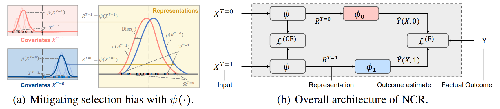

## Neighborhood matters: Local Similarity Preserved Balancing for Treatment Effect Estimation
Implementation of our submission [Neighborhood matters: Local Similarity Preserved Balancing for Treatment Effect Estimation].

#### Related concepts
- **Treatment effect**: the term refers to the causal effect of a binary (0–1) variable on an
outcome variable of scientific or policy interest.
- **Control group**: without treatment
- **Treatment group**: with treatment
- **The counterfactual**: we can not observe both treated and control responses in the exact same context


Treatment effect estimation with observational data is challenging due to treatment selection bias. Prevailing methods typically handle this by minimizing distribution discrepancy between treatment groups in the latent space, thereby aligning these groups effectively in a global view. Nevertheless, since similar units tend to have similar outcomes, neighborhood is instrumental to treatment effect estimation, yet largely overlooked by art methods. In this study, we propose neighborhood-aware counterfactual regression (NCR) to exploit neighborhood effects for representation balancing within the treatment effect estimation context. Specifically, we introduce a local similarity preservation regularizer based on optimal transport formulation to depict the neighborhood effects in discrepancy calculation. Furthermore, to overcome the curse of dimensionality that renders the estimation of discrepancy —exacerbated by limited data availability—we develop a worst-case subspace projector, which trades off minimal distance precision for improved sample complexity. 



## Reproduce the experimental results

All experiments uses GPU for training and `CUDA Verson:11.8`
## Code usage
`estimator_ncf.py`: the main file for benchmarking the performance of the proposed method
`estimator_cfr.py`: main process for CFR-MMD and CFR-WASS.  
`estimator_escfr.py`: main process for ESCFR.  
`estimator_metalearner.py`: main process for TLearner, SLearner and TARNet.  

A convenient way to call training and evaluation process:

```python estimator_gromov.py --data ACIC```
```python estimator_gromov.py --data IHDP --lambda 2.0 --fgw_alpha 0.2 --pca_ratio 0.5 --ot_scale 1.0```

**We report the results using the seeds 1-10.**

## Dataset
`./Dataset` contains the IHDP and ACIC dataset.

## Python packages version
- python == 3.9
- pytorch == 2.3
- pot == 0.9.1


